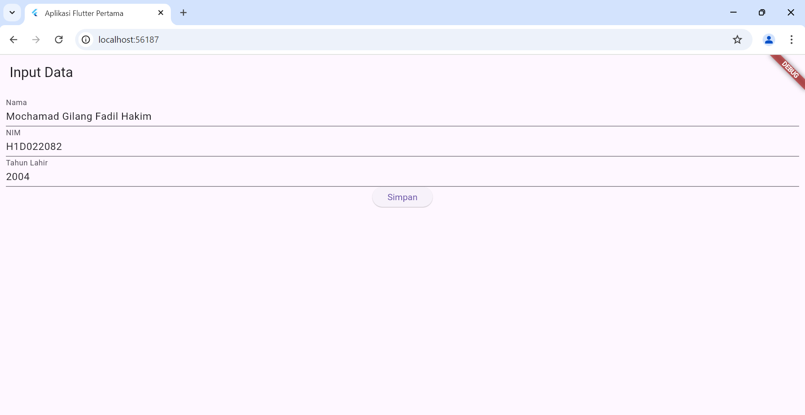
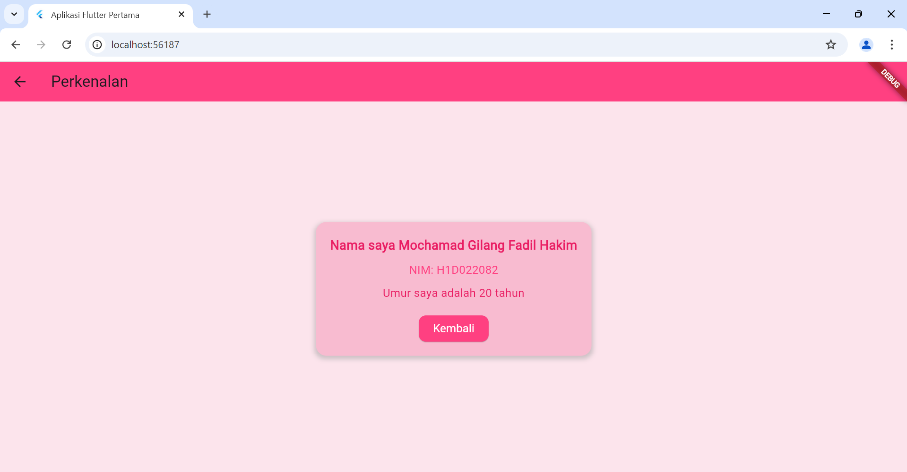

# Tugas Pertemuan 2

Nama : Mochamad Gilang Fadil Hakim

NIM : H1D022082

Shift Lama : B

Shift Baru : B

# Proses Passing Data Dari Form Ke Tampilan

- Form Input Data: Pengguna akan memasukkan informasi seperti nama, NIM, dan tahun lahir melalui form yang terletak di file ui/form_data.dart. Form tersebut memanfaatkan widget TextField untuk menerima input dari pengguna yang kemudian disimpan dalam variabel tertentu.

- Tombol Simpan: Setelah pengguna mengisi form, mereka akan menekan tombol "Simpan". Ketika tombol ini diklik, data yang dimasukkan dalam form akan disimpan ke dalam variabel (string untuk nama dan NIM, serta integer untuk tahun lahir), kemudian dikirimkan sebagai parameter ke halaman hasil menggunakan Navigator.of(context).push.

- Pindah ke Halaman Hasil: Aplikasi akan membuka halaman baru untuk menampilkan data yang telah dikirim berdasarkan input pengguna (nama, NIM, dan tahun lahir) dan mencetaknya pada halaman tersebut.

- Menampilkan Data: Di halaman hasil, data yang diterima akan ditampilkan, dan umur pengguna dihitung berdasarkan tahun lahir yang dimasukkan. Informasi ini kemudian ditampilkan kepada pengguna di halaman tersebut.

## HASIL
Contoh :

